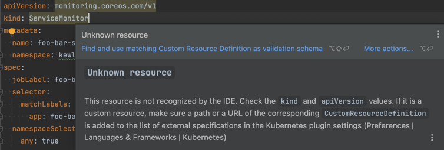
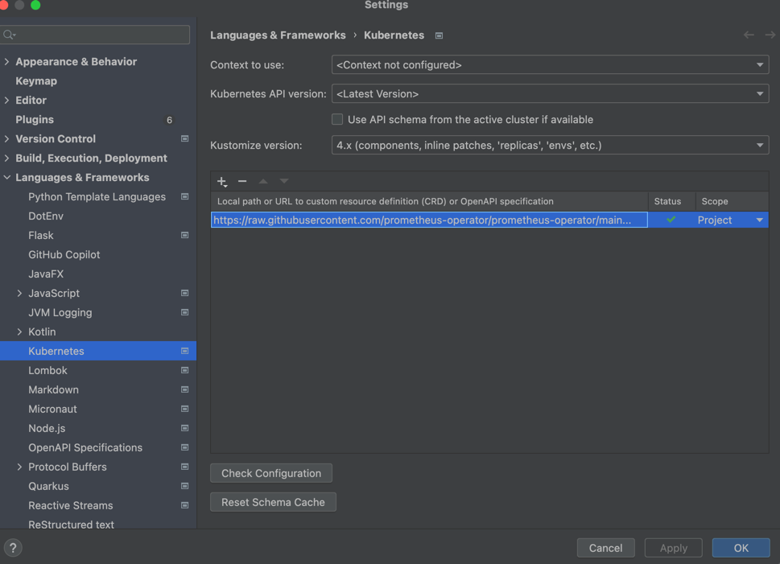
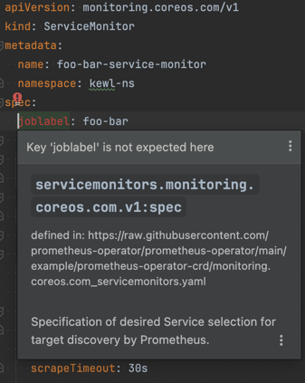
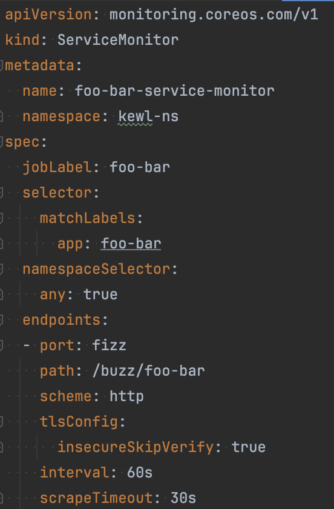

# [IntelliJ Kubernetes CRD Validation via Kubernetes Plugin](https://www.jetbrains.com/help/idea/kubernetes.html#crd)

## Problem
Kubernetes custom resource definitions lacking schema validation in IDE



## Solution
1. Find the CRD definition:
   https://raw.githubusercontent.com/prometheus-operator/prometheus-operator/main/example/prometheus-operator-crd/monitoring.coreos.com_servicemonitors.yaml
2. Navigate to Settings --> Languages & Frameworks --> Kubernetes
3. Add link to CRD via URL:



## Validation
1. No longer is the resource unknown. In fact, it is now identifying an issue in the Service Monitor definition



2. Upon fixing the identified issue in the definition, we can see a valid Service Monitor definition



## Bonus
Command line schema validation (linting) may be important, especially in an automated CI process. I recommend leveraging
the [DatreeIO CRD Catolog](https://github.com/datreeio/CRDs-catalog/tree/main) along with 
[Kubeconform](https://github.com/yannh/kubeconform) for CLI linting of your manifests.

Example (Invalid):
```
kubeconform -verbose   -kubernetes-version 1.29.9   -schema-location default   -schema-location 'https://raw.githubusercontent.com/datreeio/CRDs-catalog/main/{{.Group}}/{{.ResourceKind}}_{{.ResourceAPIVersion}}.json' ./service-monitor.yaml

ServiceMonitor foo-bar-service-monitor is invalid: problem validating schema. Check JSON formatting: jsonschema: '/spec' does not validate with https://raw.githubusercontent.com/datreeio/CRDs-catalog/main/monitoring.coreos.com/servicemonitor_v1.json#/properties/spec/additionalProperties: additionalProperties 'joblabel' not allowed
```

Example (Valid):
```
kubeconform -verbose   -kubernetes-version 1.29.9   -schema-location default   -schema-location 'https://raw.githubusercontent.com/datreeio/CRDs-catalog/main/{{.Group}}/{{.ResourceKind}}_{{.ResourceAPIVersion}}.json' ./service-monitor.yaml

ServiceMonitor foo-bar-service-monitor is valid
```
